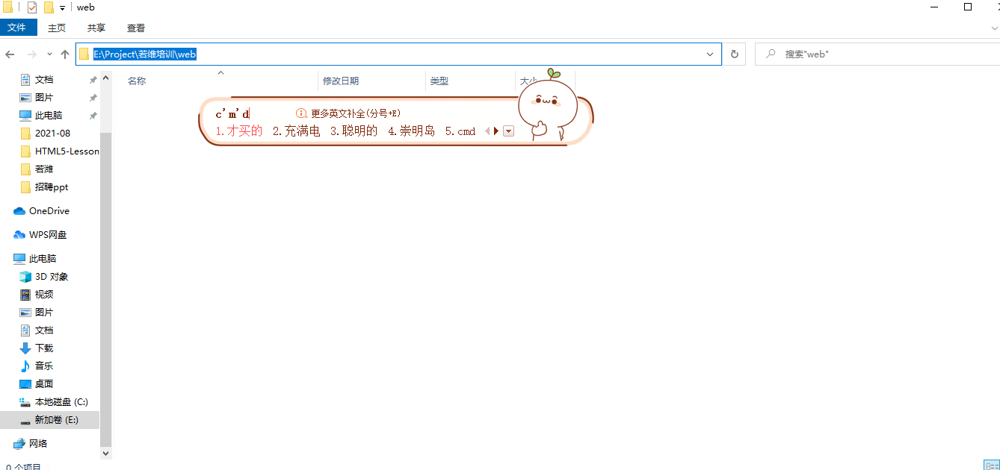
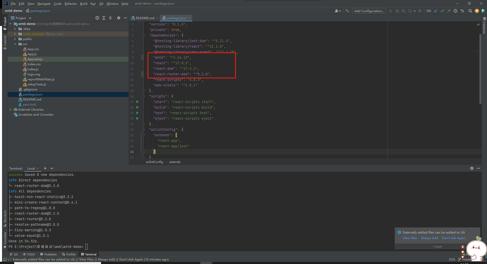

## 创建应用
####  1. 首先在本地新建web文件夹，进入文件夹内。根据以下图片操作输入cmd然后回车打开cmd命令窗口。

在cmd命令行中运行以下命令，未安装yarn的请先下载yarn

```js
yarn create react-app antd-demo   //下载react框架代码项目名称叫做antd-demo

npm install -g yarn  //全局下载yarn

yarn --version   //下载yarn后运行查看版本代表成功
```

####  2. 下载完成后使用IDEA打开antd-demo目录，可以看到package.json中并没有我们需要的u库antd和路由react-router-dom，还需要我们再另外下载，运行以下命令。
```js
yarn add antd    //项目依赖中加入antd包
yarn add @ant-design/icons  //项目依赖中加入antd图标包
yarn add react-router-dom    //项目依赖中加入react-router-dom包
```

完成依赖下载后运行yarn start命令启动项目。

##完善目录结构

```
项目名称
    |
    |---public                  // 项目级静态资源
    |---src                     // 项目主文件
    |    |---assets             // 图片、字体等其他静态资源文件
    |    |---components         // 组件文件夹
    |       |---layout          // 主界面layout布局
    |    |---utils              // 公共方法
    |    |---pages              // 页面
    |       |---login           // 登录
    |       |---main            // 主界面
    |       |---lesson          // 作业练习答案
    |       |---table           // table表格
    |    |---router             // 路由文件夹
    |       |---router.js       // 主路由配置文件
    |    |---index.js           // 入口文件
    |    |---App.css            // 全局样式表
    |--- package.json           // 项目依赖模块包的描述文件
    |--- README.md              // 项目说明文档
    |--- 其他文件
```

##项目示例代码解读

* src/pages下的所有文件是react编程的示例教程
* 其中router.js和main是react-router-dom的使用教程
* 其中login和table是antd的使用教程
* 其中lesson是react章节里作业的答案，是对父子组件传值的教程

``运行项目，查看示例代码学会如何使用react，react-router-dom和antd``